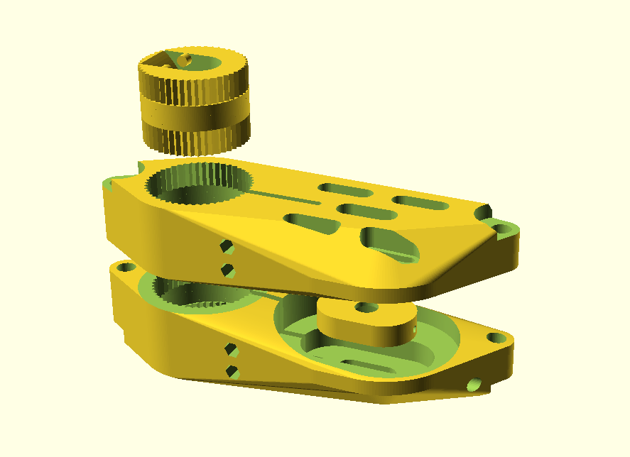

# 2in1-esk8-drive
A parametric 3D design for single-motor, dual driven wheel electric skateboards

## What is this about?

This is a parametric 3D design for a electric skateboard motor mount. 
The feature that sets it apart is that it allows to use one motor to drive two wheels of a skateboard, 
giving it more traction especially in cornering.

The parts generated by the OpenSCAD script are shown below:

## Features

- Dual wheel drive with one brushless DC motor/ESC
- Completely parametric, adjustable to your existing hardware
- Vibration-dampened (the parts touching the truck are expected to be printed in TPU)
- Variable mount-to-truck angle
- Belt-tensioning via setscrew

## How do I make this work for my board?

As the design is parametric, almost all parameters can be adjusted according to your setup.
This includes truck and motor dimensions, as well as the type and length of belt used, the number of teeth on your 
pulleys, the diameters of your screws and how sturdy you want the design to be. So just about everything.

The only thing probably requiring some work on your side is the TPU adapter to make it fit to your truck.
Due to the plethora of truck shapes out there and me only having my single board, 
I couldn't model them myself. By default, an adapter for Globe Slant Reverse Kingpin Trucks is included.
Take the output of `truckAdapterBase()` as a base for your own truck adapter.

Once you have put in your measurements, all you need to do is open the supplied .scad file with OpenSCAD, generate the STL files and print them.
All parts are expected to be printed in PETG or similar (PLA is not recommended due to it being brittle and having low tolerance for motor heat).

